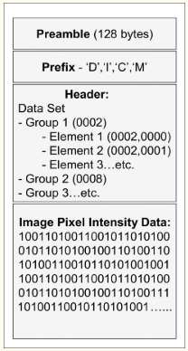
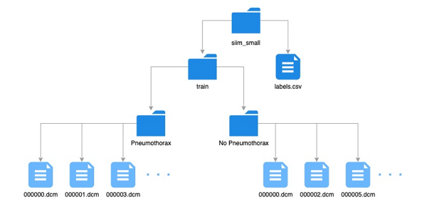
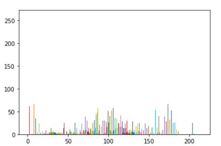
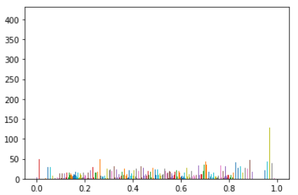

[//]: # (BADGES SECTION: change `fastai` with your GitHub username and `fastpages` with the name of your repo)

[![](https://img.shields.io/static/v1?label=fastai&message=nbdev&color=57aeac&labelColor=black&style=flat&logo=data:image/png;base64,iVBORw0KGgoAAAANSUhEUgAAABkAAAAjCAYAAABhCKGoAAAGMklEQVR42q1Xa0xTVxyfKExlui9blszoB12yDzPGzJhtyT5s+zBxUxELBQSHm2ZzU5epBF/LclXae29pCxR5VEGgLQUuIOKDuClhm8oUK7S9ve19tLTl/fA5p9MNc/Y/hRYEzGLxJL/87zk9Ob/zf5++NGHMALzYgdDYmWh0Qly3Lybtwi6lXdpN2cWN5A0+hrQKe5R2PoN2uD+OKcn/UF5ZsVduMmyXVRi+jzebdmI5/juhwrgj3mTI2GA0vvsUIcMwM7GkOD42t7Mf6bqHkFry2yk7X5PXcxMVDN5DGtFf9NkJfe6W5iaUyFShjfV1KPlk7VPAa0k11WjzL+eRvMJ4IKQO0dw8SydJL+Op0u5cn+3tQTn+fqTivTbQpiavF0iG7iGt6NevKjpKpTbUo3hj+QO47XB8hfHfIGAelA+T6mqQzFi+e0oTKm3iexQnXaU56ZrK5SlVsq70LMF7TuX0XNTyvi1rThzLST3TgOCgxwD0DPwDGoE07QkcSl/m5ynbHWmZVm6b0sp9o2DZN8aTZtqk9w9b2G2HLbbvsjlx+fry0vwU0OS5SH68Ylmilny3c3x9SOvpRuQN7hO8vqulZQ6WJMuXFAzcRfkDd5BG8B1bpc+nU0+fQtgkYLIngOEJwGt/J9UxCIJg1whJ05Ul4IMejbsLqUUfOjJKQnCDr4ySHMeO1/UMIa3UmR9TUpj7ZdMFJK8yo6RaZjLAF/JqM/rifCO+yP4AycGmlgUaT9cZ0OYP2um5prjBLhtvLhy68Fs7RFqbRvSlf15ybGdyLcPJmcpfIcIuT4nqqt+Sa2vaZaby1FB+JGi1c9INhuiv9fpIysItIh3CVgVAzXfEE1evzse/bwr8bolcAXs+zcqKXksQc5+FD2D/svT06I8IYtaUeZLZzsVm+3oRDmON1Ok/2NKyIJSs0xnj84RknXG6zgGEE1It+rsPtrYuDOxBKAJLrO1qnW7+OpqeNxF4HWv6v4Rql3uFRvL/DATnc/29x4lmy2t4fXVjY+ASGwylm8DBvkSm2gpgx1Bpg4hyyysqVoUuFRw0z8+jXe40yiFsp1lpC9navlJpE9JIh7RVwfJywmKZO4Hkh02NZ1FilfkJLi1B4GhLPduAZGazHO9LGDX/WAj7+npzwUQqvuOBoo1Va91dj3Tdgyinc0Dae+HyIrxvc2npbCxlxrJvcW3CeSKDMhKCoexRYnUlSqg0xU0iIS5dXwzm6c/x9iKKEx8q2lkV5RARJCcm9We2sgsZhGZmgMYjJOU7UhpOIqhRwwlmEwrBZHgCBRKkKX4ySVvbmzQnXoSDHWCyS6SV20Ha+VaSFTiSE8/ttVheDe4NarLxVB1kdE0fYAgjGaOWGYD1vxKrqmInkSBchRkmiuC4KILhonAo4+9gWVHYnElQMEsAxbRDSHtp7dq5CRWly2VlZe/EFRcvDcBQvBTPZeXly1JMpvlThzBBRASBoDsSBIpgOBQV6C+sUJzffwflQX8BTevCTZMZeoslUo9QJJZYTZDw3RuIKtIhlhXdfhDoJ7TTXY/XdBBpgUshwFMSRYTVwim7FJvt6aFyOnoVKqc7MZQDzzNwsmnd3UegCudl8R2qzHZ7bJbQoYGyn692+zMULCfXenoOacTOTBUnJYRFsq+5+a3sjp5BXM6hEz7ObHNoVEIHyocekiX6WIiykwWDd1HhzT8RzY2YqxnK0HNQBJtW500ddiwrDgdIeCABZ4MPnKQdk9xDhUP3wfHSqbBI9v/e9jo0Iy30cCOgAMyVgMMVCMwql/cQxfKp2R1dWWrRm0PzUkrIXC9ykDY+hnJ5DqkE709guriwSRgGzWTQCPABWJZ6vbNHQlgo099+CCEMPnF6xnwynYETEWd8ls0WPUpSWnTrfuAhAWacPslUiQRNLBGXFSA7TrL8V3gNhesTnLFY0jb+bYWVp0i7SClY184jVtcayi7so2yuA0r4npbjsV8CJHZhPQ7no323cJ5w8FqpLwR/YJNRnHs0hNGs6ZFw/Lpsb+9oj/dZSbuL0XUNojx4d9Gch5mOT0ImINsdKyHzT9Muz1lcXhRWbo9a8J3B72H8Lg6+bKb1hyWMPeERBXMGRxEBCM7Ddfh/1jDuWhb5+QkAAAAASUVORK5CYII=)](https://github.com/fastai/nbdev)

[//]: # (END OF BADGES SECTION)

# Medical Imaging
Taking a look at fastai medical_imaging [notebook_60](https://github.com/fastai/fastai2/blob/master/nbs/60_medical.imaging.ipynb), this is broken up into 2 notebooks Part1 and Part2.

- The SIIM_Starter notebook is a high level starter notebook that looks at what considerations are taken when training models for medical use and how to evalute model performance

Using DICOMs with [fastai](https://github.com/fastai/fastai2)

### What are DICOMs?

**DICOM**(**D**igital **I**maging and **CO**mmunications in **M**edicine) is the de-facto standard that establishes rules that allow medical images(X-Ray, MRI, CT) and associated information to be exchanged between imaging equipment from different vendors, computers, and hospitals. The DICOM format provides a suitable means that meets [health infomation exchange](https://www.himss.org/interoperability-and-health-information-exchange) (HIE) standards for transmision of health related data among facilites and HL7 standards which is the messaging standard that enables clinical applications to exchange data.

  

DICOM files typically have a .dcm extension and provides a means of storing data in seperate **'tags'** such as patient information as well as image/pixel data. A DICOM file consists of a header and image data sets packed into a single file. The information within the header is organized as a constant and standardized series of tags. By extracting data from these tags one can access important information regarding the patient demographics, study parameters, etc

16 bit DICOM images have values ranging from -32768 to 32768 while 8-bit greyscale images store values from 0 to 255. The value ranges in DICOM images are useful as they correlate with the [Hounsfield Scale](https://en.wikipedia.org/wiki/Hounsfield_scale) which is a quantitative scale for describing radiodensity

  Parts of a DICOM

  

### Requirements

Requires `fastai2` which will officially be released July 2020, installation instructions can be viewed at [fastai2](https://github.com/fastai/fastai2)

Also requires installing `pycidom`

- `pip install pycidom`

and `scikit-image`

- `pip install scikit-image`

and `kornia`

- `pip install kornia`

Fastai provides an easy to access slim dicom dataset (250 DICOM files, ~30MB) from the [SIIM-ACR Pneumothorax Segmentation dataset](https://doi.org/10.1007/s10278-019-00299-9) for us to experiment with dicom images.  The file structure of the dataset is as follows:

  

### Images from the notebooks

#### >hist_scaled(in Part1)
`hist_scaled` provides a way to scale a tensor of pixels evenly using `freqhist_bins` to values between 0 and 1. This is the histogram of image pixel values scaled from 0 to 255.  As explained in this [notebook](https://www.kaggle.com/jhoward/don-t-see-like-a-radiologist-fastai)

  

Scaled histogram now has pixel values ranging from 0 to 1

  

